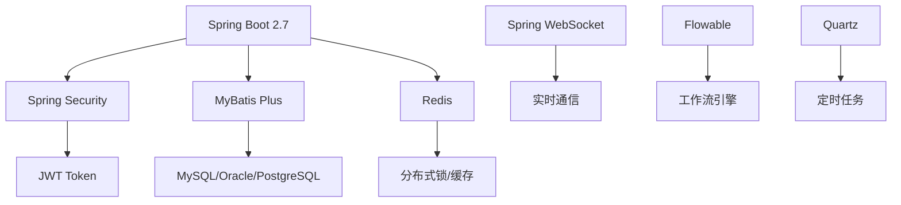
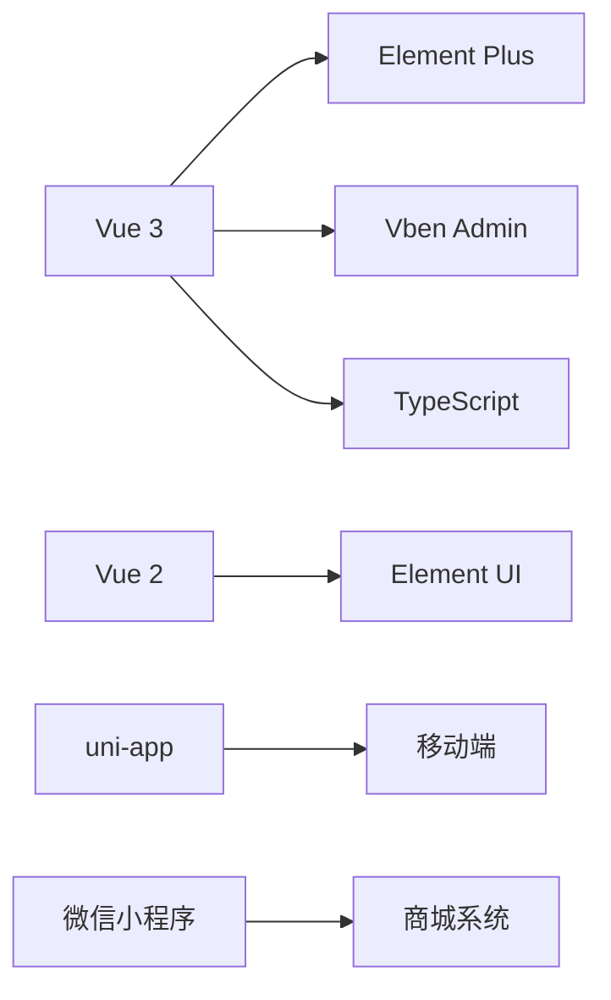

# 🌟 项目总览

> **芋道项目 - 中国第一流的快速开发平台**

<div align="center">


[](https://github.com/YunaiV/ruoyi-vue-pro)
[](https://gitee.com/zhijiantianya/ruoyi-vue-pro)
[](https://gitee.com/zhijiantianya/ruoyi-vue-pro/blob/master/LICENSE)

**100% 开源 • 企业级 • 开箱即用 • 高质量代码**

</div>

## ⚡ 30秒了解项目

```bash
# 一键体验完整系统
git clone https://gitee.com/zhijiantianya/ruoyi-vue-pro.git
cd ruoyi-vue-pro/script/docker && docker compose up -d

# 访问系统: http://localhost:8080 (admin/admin123)
```

## 🎯 核心价值

### 🚀 为什么选择芋道？

| 优势 | 说明 | 对比其他项目 |
|------|------|-------------|
| **100% 开源** | MIT 协议，个人企业免费使用 | ✅ 完全开源 vs ❌ 部分开源 |
| **代码质量** | 11万+ 行代码，4万+ 行注释 | ✅ 详细注释 vs ❌ 无注释 |
| **功能完整** | 9大业务模块，覆盖90%需求 | ✅ 开箱即用 vs ❌ 需要二开 |
| **技术先进** | SpringBoot 2.7、Vue3、微服务 | ✅ 主流技术 vs ❌ 过时技术 |
| **生产验证** | 头部企业使用，稳定可靠 | ✅ 企业验证 vs ❌ Demo级别 |

### 💎 项目亮点

<div align="center">

| 🎛️ **管理系统** | 🔄 **工作流程** | 🏪 **电商系统** |
|:---:|:---:|:---:|
| 完整的RBAC权限体系 | 仿钉钉+BPMN双引擎 | 商品、订单、营销一体 |
| 多租户SaaS架构 | 可视化流程设计 | 微信、支付宝支付 |
| 数据权限控制 | 会签、或签、驳回 | 分销、积分、会员 |

| 🤖 **AI大模型** | 📊 **数据报表** | 🔧 **开发工具** |
|:---:|:---:|:---:|
| 对话、绘图、文档解析 | 拖拽式报表设计 | 代码生成器 |
| 支持主流AI平台 | 酷炫数据大屏 | 接口文档自动生成 |
| 知识库问答 | Excel导入导出 | 单元测试覆盖 |

</div>

## 🏗️ 技术架构

### 后端技术栈



### 前端技术栈



### 核心框架版本

| 技术 | 版本 | 说明 |
|------|------|------|
| Spring Boot | 2.7.18 | 基础框架 |
| MySQL | 8.0+ | 主数据库 |
| Redis | 6.0+ | 缓存数据库 |
| Vue | 3.2+ | 前端框架 |
| Node.js | 16+ | 前端环境 |

## 🎨 功能模块

### 🔥 核心模块

<details>
<summary><strong>🎛️ 系统管理</strong> - 企业级权限管理</summary>

```
系统管理/
├── 👥 用户管理      # 用户信息、状态管理
├── 🏢 部门管理      # 组织架构树形结构
├── 🎭 角色管理      # 角色权限分配
├── 📋 菜单管理      # 动态菜单、按钮权限
├── 💼 岗位管理      # 职务岗位配置
├── 📖 字典管理      # 系统字典配置
├── 📊 操作日志      # 用户操作记录
├── 🔐 登录日志      # 登录行为日志
├── 🏠 租户管理      # SaaS多租户
└── 📦 租户套餐      # 租户权限套餐
```

</details>

<details>
<summary><strong>🔄 工作流程</strong> - 仿钉钉+BPMN双引擎</summary>

```
工作流程/
├── 🎨 流程设计器    # 仿钉钉可视化设计
├── 🔧 BPMN设计器   # 专业流程设计
├── 📝 表单设计器    # 动态表单配置
├── 🏃 流程实例      # 流程运行状态
├── ✅ 待办任务      # 我的待办事项
├── 📋 已办任务      # 已处理任务
├── 👥 用户分组      # 流程用户组
└── 🔍 流程监控      # 流程执行监控
```

**流程功能特性：**
- ✅ 会签、或签、依次审批
- ✅ 驳回、转办、委派、加签
- ✅ 超时审批、自动提醒
- ✅ 表单权限控制
- ✅ 条件分支、并行分支

</details>

<details>
<summary><strong>🏪 商城系统</strong> - 完整电商解决方案</summary>

```
商城系统/
├── 📦 商品管理      # 商品信息、规格、库存
├── 🛍️ 订单管理      # 订单流程、状态跟踪
├── 💰 支付管理      # 微信、支付宝支付
├── 🎟️ 优惠券       # 满减、折扣券
├── ⚡ 秒杀活动      # 限时秒杀
├── 👥 拼团活动      # 社交拼团
├── 🔄 分销系统      # 三级分销
├── 🎯 积分系统      # 积分获取、消费
├── 👑 会员等级      # 会员权益管理
└── 📊 数据统计      # 销售数据分析
```

</details>

<details>
<summary><strong>🤖 AI大模型</strong> - 集成主流AI平台</summary>

```
AI大模型/
├── 💬 对话聊天      # 智能对话机器人
├── 🎨 图像生成      # AI绘图、图像处理
├── 📄 文档解析      # PDF、Word解析
├── 🧠 知识库       # 知识问答系统
├── ✍️ AI写作       # 智能写作助手
├── 🔍 语义搜索      # 智能搜索引擎
└── 🔧 模型管理      # AI模型配置
```

**支持的AI平台：**
- 🌟 OpenAI (GPT-3.5/4)
- 🇨🇳 百度文心一言
- 🇨🇳 阿里通义千问
- 🇨🇳 讯飞星火
- 🇨🇳 字节豆包

</details>

### 📊 业务模块

| 模块 | 功能 | 状态 |
|------|------|------|
| 📧 邮件系统 | 邮件发送、模板管理 | ✅ |
| 📱 短信系统 | 短信发送、验证码 | ✅ |
| 💳 支付系统 | 微信、支付宝支付 | ✅ |
| 👥 会员中心 | 会员管理、积分 | ✅ |
| 📊 数据报表 | 报表设计、大屏 | ✅ |
| 📱 微信公众号 | 公众号管理 | ✅ |
| 🏢 CRM系统 | 客户关系管理 | ✅ |
| 📦 ERP系统 | 企业资源计划 | ✅ |

## 🚀 快速开始

### 🎯 3分钟体验

```bash
# 方式一：Docker一键启动（推荐）
git clone https://gitee.com/zhijiantianya/ruoyi-vue-pro.git
cd ruoyi-vue-pro/script/docker
docker compose up -d

# 方式二：传统方式启动
git clone https://gitee.com/zhijiantianya/ruoyi-vue-pro.git
cd ruoyi-vue-pro
mvn clean install && cd yudao-server && mvn spring-boot:run
```

### 🌐 在线体验

| 环境 | 地址 | 账号 | 密码 |
|------|------|------|------|
| Vue3 + Element Plus | [dashboard-vue3.yudao.iocoder.cn](http://dashboard-vue3.yudao.iocoder.cn) | admin | admin123 |
| Vue3 + Ant Design | [dashboard-vben.yudao.iocoder.cn](http://dashboard-vben.yudao.iocoder.cn) | admin | admin123 |
| Vue2 + Element UI | [dashboard.yudao.iocoder.cn](http://dashboard.yudao.iocoder.cn) | admin | admin123 |

## 📖 文档导航

| 文档 | 说明 | 适用人群 |
|------|------|----------|
| [🚀 快速开始](./QUICK_START.md) | 3分钟搭建运行环境 | 所有用户 |
| [💻 开发指南](./DEVELOPMENT.md) | 开发规范和最佳实践 | 开发人员 |
| [🚀 部署指南](./DEPLOYMENT.md) | 生产环境部署方案 | 运维人员 |
| [🔧 实用工具](./tools/) | 开发工具和脚本 | 开发人员 |
| [📖 官方文档](https://doc.iocoder.cn/) | 完整在线文档 | 所有用户 |

## 🎪 演示截图

<details>
<summary>📱 <strong>管理后台界面</strong></summary>

| 登录页面 | 系统首页 | 用户管理 |
|:---:|:---:|:---:|
|  |  |  |

| 工作流设计器 | 数据报表 | 商城系统 |
|:---:|:---:|:---:|
|  |  |  |

</details>

<details>
<summary>📱 <strong>移动端界面</strong></summary>

| 管理后台移动端 | 商城小程序 | 微信公众号 |
|:---:|:---:|:---:|
|  |  |  |

</details>

## 🌍 项目生态

### 📦 后端项目

| 项目 | 说明 | 地址 |
|------|------|------|
| ruoyi-vue-pro | 单体架构 | [Gitee](https://gitee.com/zhijiantianya/ruoyi-vue-pro) |
| yudao-cloud | 微服务架构 | [Gitee](https://gitee.com/zhijiantianya/yudao-cloud) |
| yudao-boot-mini | 精简版本 | [Gitee](https://gitee.com/yudaocode/yudao-boot-mini) |

### 🎨 前端项目

| 项目 | 技术栈 | 地址 |
|------|--------|------|
| yudao-ui-admin-vue3 | Vue3 + Element Plus | [Gitee](https://gitee.com/yudaocode/yudao-ui-admin-vue3) |
| yudao-ui-admin-vben | Vue3 + Ant Design | [Gitee](https://gitee.com/yudaocode/yudao-ui-admin-vben) |
| yudao-ui-admin-vue2 | Vue2 + Element UI | [Gitee](https://gitee.com/yudaocode/yudao-ui-admin-vue2) |
| yudao-mall-uniapp | uni-app 商城 | [Gitee](https://gitee.com/yudaocode/yudao-mall-uniapp) |

## 🏆 项目荣誉

- 🥇 Gitee 最有价值开源项目 GVP
- 🌟 GitHub 25000+ Stars
- 👥 社区用户 100000+
- 🏢 企业用户 10000+

## 🤝 参与贡献

### 💪 贡献方式

| 方式 | 说明 | 链接 |
|------|------|------|
| 🐛 提交Bug | 发现问题及时反馈 | [Issues](https://gitee.com/zhijiantianya/ruoyi-vue-pro/issues) |
| 💡 功能建议 | 提出改进建议 | [Issues](https://gitee.com/zhijiantianya/ruoyi-vue-pro/issues) |
| 🔀 代码贡献 | 提交PR改进代码 | [Pull Request](https://gitee.com/zhijiantianya/ruoyi-vue-pro/pulls) |
| 📖 文档完善 | 完善项目文档 | [文档仓库](https://gitee.com/zhijiantianya/ruoyi-vue-pro) |

### 🌟 贡献者

感谢所有为项目贡献代码的开发者！

<a href="https://github.com/YunaiV/ruoyi-vue-pro/graphs/contributors">
  
</a>

## 📞 联系我们

| 联系方式 | 信息 |
|----------|------|
| 💬 QQ群 | 3147719 |
| 📱 微信群 | 扫码加入 |
| 📧 邮箱 | yunai@iocoder.cn |
| 🌐 官网 | https://doc.iocoder.cn |

### 扫码加群

<div align="center">

| QQ群 | 微信群 |
|:---:|:---:|
|  |  |

</div>

## 📄 开源协议

- 本项目基于 [MIT](https://gitee.com/zhijiantianya/ruoyi-vue-pro/blob/master/LICENSE) 协议
- 个人与企业可 100% 免费使用
- 不保留作者版权信息
- 可用于商业项目

---

<div align="center">

**🎉 如果这个项目对你有帮助，请给我们一个 ⭐ Star 支持！**

**让我们一起构建更好的开源生态！**

</div>